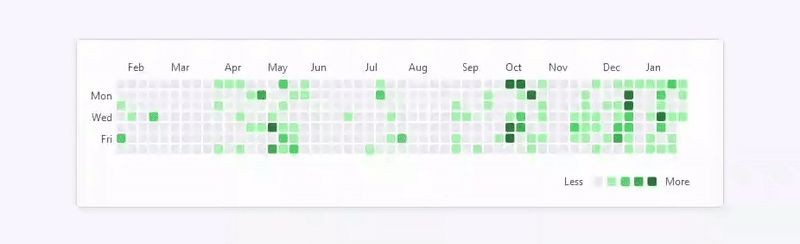

# GitHub Contribution Calendar

Easily visualize and embed your GitHub contribution activity with this customizable, interactive calendar.



## Features
- Fetches contribution data using the GitHub GraphQL API.
- Interactive heatmap with color-coded activity levels.

## Quick Start

1. Clone the repository:
   ```bash
   git clone https://github.com/yourusername/github-contribution-calendar.git
   ```

2. Generate a GitHub Personal Access Token:
   - Go to [GitHub Developer Settings](https://github.com/settings/tokens).
   - Click "Generate new token".
   - Select "repo" and "read:org" scopes (or adjust scopes based on your needs).
   - Copy the generated token and save it securely.

3. Update `script.js` with your GitHub token and username:
   ```javascript
   const token = 'YOUR_GITHUB_TOKEN';
   const username = 'YOUR_GITHUB_USERNAME';
   ```

4. Open `index.html` in a browser to see your contribution calendar.

### Embedding
Add this to your webpage:
```html
<div id="contribution-calendar"></div>
<script src="script.js"></script>
```

---

Simplify your GitHub stats showcase today!